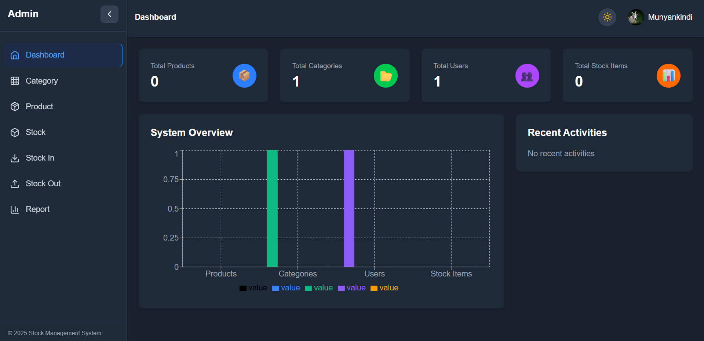

<div align="center">
  
  
  # 📦 Stock Management System
  
  ### Transform Your Inventory Operations with Smart Technology
  
  <p>
    <strong>A comprehensive solution designed to streamline inventory management, reduce costs, and boost operational efficiency for modern businesses.</strong>
  </p>

  <p align="center">
    <a href="#why-choose-us">Why Choose Us</a> •
    <a href="#key-capabilities">Capabilities</a> •
    <a href="#business-benefits">Benefits</a> •
    <a href="#technology">Technology</a> •
    <a href="#get-started">Get Started</a>
  </p>
</div>

---

## 🎯 Overview

In today's competitive marketplace, efficient inventory management is crucial for business success. Our **Stock Management System** provides a powerful, intuitive platform that helps businesses optimize their inventory operations, reduce costs, and make data-driven decisions.

<div align="center">
  
  <p><em>Modern dashboard with real-time insights</em></p>
</div>

---

## 💼 Why Choose Us

### Built for Business Growth

Our solution addresses the critical challenges faced by growing businesses:

✅ **Eliminate Stock Issues** - Never run out of critical inventory or overstock slow-moving items  
✅ **Save Time & Money** - Automate manual processes and reduce operational costs by up to 40%  
✅ **Make Better Decisions** - Access real-time data and analytics for informed business choices  
✅ **Scale Confidently** - System grows with your business from startup to enterprise  
✅ **Secure & Reliable** - Enterprise-grade security protecting your sensitive business data

---

## 🚀 Key Capabilities

### Inventory Control

Transform how you manage stock with intelligent tracking and automation that keeps your business running smoothly.

- **Real-time Stock Visibility** - Know exactly what you have, where it is, and when to reorder
- **Automated Alerts** - Get notified when stock levels reach critical thresholds
- **Product Categorization** - Organize inventory with flexible category management
- **Batch Processing** - Handle large volume operations efficiently

### Business Intelligence

<div align="center">
  
  <p><em>Comprehensive analytics for smarter decisions</em></p>
</div>

Make data work for you with powerful analytics and reporting tools.

- **Visual Dashboards** - See your business performance at a glance
- **Custom Reports** - Generate detailed reports tailored to your needs
- **Trend Analysis** - Identify patterns and forecast future demands
- **Activity Tracking** - Complete audit trail for compliance and accountability

### Team Collaboration

Empower your team with the right tools and permissions for seamless operations.

- **Multi-user Access** - Support unlimited team members working together
- **Role-based Permissions** - Control who can view, edit, or manage different areas
- **Activity Logs** - Track all changes with comprehensive audit trails
- **Secure Authentication** - Protect your business with robust security measures

### User Experience

Your team will love using it - and that means better adoption and results.

- **Intuitive Design** - Clean, modern interface requiring minimal training
- **Mobile Responsive** - Access from anywhere on any device
- **Dark Mode** - Comfortable viewing for extended use
- **Fast Performance** - Lightning-fast response times for efficient workflows

---

## 📊 Business Benefits

### Measurable ROI

Companies using our system typically see:

| Metric                 | Improvement             |
| ---------------------- | ----------------------- |
| 📉 **Inventory Costs** | Reduced by 25-40%       |
| ⏱️ **Time Savings**    | 10+ hours per week      |
| 📈 **Accuracy**        | 99%+ inventory accuracy |
| 💰 **Cost Reduction**  | Lower carrying costs    |
| 🎯 **Efficiency**      | 50% faster processing   |

### Industry Applications

Our solution adapts to various business types:

- **Retail & E-commerce** - Multi-location inventory tracking
- **Manufacturing** - Raw materials and finished goods management
- **Wholesale Distribution** - Large-volume stock control
- **Healthcare** - Medical supplies and equipment tracking
- **Hospitality** - Food, beverage, and supplies management

---

## 🛡️ Enterprise-Grade Technology

### Built on Modern, Proven Technology

We use industry-leading technologies to ensure reliability, security, and performance:

- ⚡ **High Performance** - Fast, responsive interface handling thousands of transactions
- 🔒 **Bank-Level Security** - Encrypted data transmission and secure authentication
- 📱 **Cross-Platform** - Works seamlessly on desktop, tablet, and mobile
- 🌐 **Cloud-Ready** - Deploy on-premise or in the cloud
- 🔄 **Always Updated** - Regular updates with new features and improvements

### Integration Capabilities

Designed to work with your existing systems:

- REST API for third-party integrations
- Email notifications and reporting
- Cloud storage for images and documents
- Export data in multiple formats

---

## 💡 What Makes Us Different

### 1. **User-Centric Design**

Built based on real user feedback from businesses like yours. Every feature solves actual business problems.

### 2. **Scalable Architecture**

Starts simple but grows with you. Add users, locations, and features as your needs evolve.

### 3. **Transparent & Flexible**

No hidden fees or forced upgrades. You control your deployment and data.

### 4. **Quick Implementation**

Get up and running in days, not months. Minimal disruption to your operations.

---

## 📈 Success Stories

> _"This system cut our inventory processing time in half. We can now focus on growing our business instead of managing spreadsheets."_
>
> **— Operations Manager, Retail Company**

> _"The real-time visibility has been a game-changer. We've reduced stockouts by 85% and our customers are happier."_
>
> **— Supply Chain Director, Distribution Business**

---

## 🎯 Get Started

### Quick Demo Setup

Experience the system yourself in minutes:

**Prerequisites:**

- Node.js 18+ and MySQL 8+ installed
- 15 minutes of setup time

**Installation:**

```bash
# 1. Clone and setup backend
cd backend && npm install
npx prisma migrate dev
npm run dev

# 2. Setup frontend
cd frontend && npm install
npm run dev
```

Visit `http://localhost:5173` to explore the full system.

---

## 🤝 Partnership Opportunities

We're looking for the right partners to help bring this solution to businesses that need it.

### What We Offer

- ✅ Customization options for your specific requirements
- ✅ Dedicated technical support during implementation
- ✅ Training and documentation for your team
- ✅ Ongoing updates and maintenance
- ✅ Flexible licensing arrangements

### Let's Talk

Interested in learning more or seeing a personalized demo?

📧 **Email:** contact@yourbusiness.com  
📞 **Phone:** +1 (555) 123-4567  
🌐 **Website:** www.yourwebsite.com  
💼 **Schedule Demo:** [Book a time](https://calendly.com/yourlink)

---

## 📞 Contact & Support

### Get in Touch

We're here to answer your questions and discuss how our solution can benefit your business.

**Sales Inquiries:** sales@yourbusiness.com  
**Technical Support:** support@yourbusiness.com  
**General Questions:** info@yourbusiness.com

### Schedule a Consultation

Book a free 30-minute consultation to discuss your inventory management needs:

[📅 **Schedule Now**](https://calendly.com/yourlink)

---

<div align="center">
  <p><strong>Ready to transform your inventory management?</strong></p>
  <p>Let's discuss how we can help your business thrive.</p>
  <br>
  <p>
    <a href="mailto:contact@yourbusiness.com">
      
    </a>
    <a href="#get-started">
      
    </a>
  </p>
  <br>
  <p>© 2025 Stock Management System. All rights reserved.</p>
  
  [⬆ Back to Top](#-stock-management-system)
</div>
